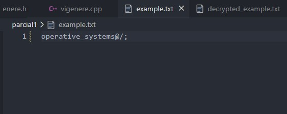
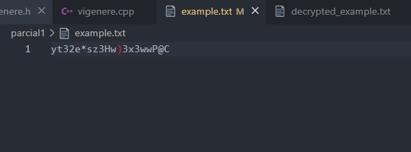
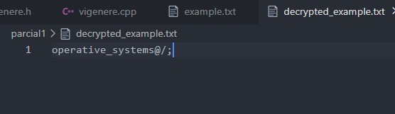

# Vigenere Cipher Implementation

This project implements the Vigenere cipher for encrypting and decrypting text files using system calls in C++. The Vigenere cipher is a method of encrypting alphabetic text by using a simple form of polyalphabetic substitution.

**This program is intended to work EXCLUSEVELY with text files**
## Files

- `vigenere.h`: Header file containing the declarations of the Vigenere class and related functions.
- `vigenere.cpp`: Implementation file containing the definitions of the Vigenere class methods and related functions.
- `example.txt`: Example input file to be encrypted and decrypted.

## Usage

### Limitations

The alphabet is limited to the following characters:
```
ABCDEFGHIJKLMNOPQRSTUVWXYZabcdefghijklmnopqrstuvwxyz1234567890 ,!.¿?*+-/(){}[]=<>@#$%&:_;';
```

### Compilation

To compile the project, use the following command:

```sh
make
```

### Execution

```sh
./main
```

### Demo

#### Input Example


#### Output Encrypted


#### Output Decrypted


## Collaborators

- [Juan Andrés Montoya](https://github.com/Jkn707)
- [Valeria Corrales](https://github.com/valchys)
- [Jose Tordecilla](https://github.com/josetor101)